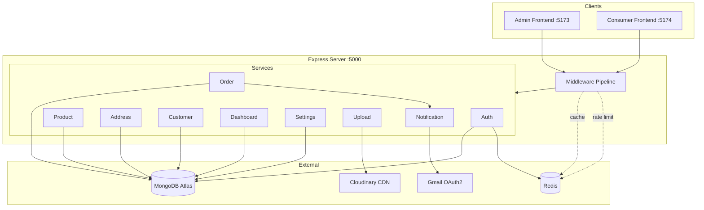

# OOPS Backend

Single Node.js + Express + MongoDB Atlas backend serving both the admin dashboard (`:5173`) and consumer storefront (`:5174`).

## System Overview



## Request Lifecycle

```
  Request
    │
    ▼
  Helmet → CORS → Mongo Sanitize → Body Parser → Cookie Parser → Compression → Morgan
    │
    ▼
  Rate Limiter (per-route)
    │
    ▼
  Route Match → Validation? → Auth? → Admin? → Cache?
    │                                             │
    │                                         HIT ▼
    │                                       Return cached
    │
    ▼ MISS
  Controller → Service → MongoDB
    │
    ▼
  Response (+ write to cache)
    │
    ▼
  Error Handler (catches Mongoose, JWT, Multer, ApiError)
```

## Services

Each service has its own README with architecture diagrams:

| Service | Path | README | Description |
|---------|------|--------|-------------|
| **Auth** | `src/auth/` | [README](src/auth/README.md) | Signup, login, OTP, 2FA, JWT + refresh tokens |
| **Product** | `src/product/` | [README](src/product/README.md) | CRUD, stock map, public + admin |
| **Order** | `src/order/` | [README](src/order/README.md) | Atomic stock deduction, forward-only status |
| **Address** | `src/address/` | [README](src/address/README.md) | Consumer CRUD with ownership checks |
| **Customer** | `src/customer/` | [README](src/customer/README.md) | Derived from orders via aggregation |
| **Dashboard** | `src/dashboard/` | [README](src/dashboard/README.md) | 5 aggregation endpoints for admin |
| **Settings** | `src/settings/` | [README](src/settings/README.md) | Gmail connection + email triggers |
| **Upload** | `src/upload/` | [README](src/upload/README.md) | Multer → Cloudinary pipeline |
| **Notification** | `src/notification/` | [README](src/notification/README.md) | Gmail OAuth2 email sending |
| **Middleware** | `src/middleware/` | [README](src/middleware/README.md) | Auth, cache, rate limit, validation, error |

## Data Models

```mermaid
erDiagram
    USER ||--o{ REFRESH_TOKEN : "has sessions"
    USER ||--o{ ORDER : "places"
    USER ||--o{ ADDRESS : "saves"
    ORDER }o--|| PRODUCT : "snapshots items from"
    OTP }o--|| USER : "sent to email of"

    USER { string name; string email; string role; boolean isVerified }
    PRODUCT { string name; number price; string status; map stock }
    ORDER { string orderId; string status; number total; array items }
    ADDRESS { string fullName; string city; string pincode }
    CONFIG { string key; mixed value }
```

## API Routes (44 endpoints)

| Method | Path | Auth | Service |
|--------|------|------|---------|
| POST | `/api/auth/send-otp` | - | Auth |
| POST | `/api/auth/verify-otp` | - | Auth |
| POST | `/api/auth/signup` | - | Auth |
| POST | `/api/auth/login` | - | Auth |
| POST | `/api/auth/refresh` | Cookie | Auth |
| POST | `/api/auth/logout` | Cookie | Auth |
| POST | `/api/auth/logout-all` | JWT | Auth |
| POST | `/api/auth/reset-password` | - | Auth |
| GET | `/api/auth/me` | JWT | Auth |
| PATCH | `/api/auth/profile` | JWT | Auth |
| POST | `/api/auth/change-password` | JWT | Auth |
| POST | `/api/admin/auth/login` | - | Auth |
| POST | `/api/admin/auth/verify-otp` | - | Auth |
| GET | `/api/products` | - | Product |
| GET | `/api/products/:id` | - | Product |
| GET | `/api/admin/products` | Admin | Product |
| POST | `/api/admin/products` | Admin | Product |
| PUT | `/api/admin/products/:id` | Admin | Product |
| DELETE | `/api/admin/products/:id` | Admin | Product |
| PATCH | `/api/admin/products/:id/stock` | Admin | Product |
| POST | `/api/orders` | JWT | Order |
| GET | `/api/orders` | JWT | Order |
| GET | `/api/orders/:orderId` | JWT | Order |
| GET | `/api/admin/orders` | Admin | Order |
| GET | `/api/admin/orders/:orderId` | Admin | Order |
| PATCH | `/api/admin/orders/:orderId/status` | Admin | Order |
| GET | `/api/addresses` | JWT | Address |
| POST | `/api/addresses` | JWT | Address |
| PUT | `/api/addresses/:id` | JWT | Address |
| DELETE | `/api/addresses/:id` | JWT | Address |
| GET | `/api/admin/customers` | Admin | Customer |
| GET | `/api/admin/customers/:phone` | Admin | Customer |
| GET | `/api/admin/dashboard/stats` | Admin | Dashboard |
| GET | `/api/admin/dashboard/revenue-by-day` | Admin | Dashboard |
| GET | `/api/admin/dashboard/status-breakdown` | Admin | Dashboard |
| GET | `/api/admin/dashboard/top-products` | Admin | Dashboard |
| GET | `/api/admin/dashboard/recent-orders` | Admin | Dashboard |
| GET | `/api/admin/settings/connections` | Admin | Settings |
| PUT | `/api/admin/settings/connections/:id` | Admin | Settings |
| DELETE | `/api/admin/settings/connections/:id` | Admin | Settings |
| GET | `/api/admin/settings/email-triggers` | Admin | Settings |
| PUT | `/api/admin/settings/email-triggers` | Admin | Settings |
| POST | `/api/upload` | Admin | Upload |
| DELETE | `/api/upload` | Admin | Upload |
| GET | `/api/health` | - | Health |

## Getting Started

```bash
npm install
cp .env.example .env       # edit with your MongoDB URI, JWT secrets
npm run seed               # creates admin + sample data
npm run dev                # starts on :5000
curl localhost:5000/api/health
```

Seed creates: admin (`admin@oopsfashion.com` / `admin123`), 4 products, 7 orders, default config.
