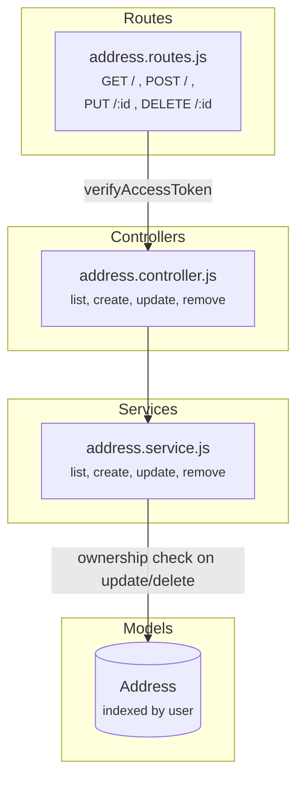

# Address Service

Consumer-facing CRUD for saved shipping addresses with ownership enforcement.

## Architecture



## Folder Structure

```
address/
  index.js                          # Barrel: exports router
  models/
    Address.js                      # user (ref), fullName, phone, address1/2, city, state, pincode
  controllers/
    address.controller.js           # list, create, update, remove
  services/
    address.service.js              # CRUD with address.user === req.user check
  routes/
    address.routes.js               # All routes require JWT
  validations/
    address.validation.js           # create + update schemas (pincode 6-digit, phone 10-digit)
```

## Ownership Model

```
  Consumer A                    Server                          MongoDB
    │                             │                               │
    │  PUT /addresses/:id         │                               │
    │  { city: "Pune" }           │                               │
    │────────────────────────────►│  Address.findById(id)         │
    │                             │  address.user === req.user?   │
    │                             │       │                       │
    │                             │   YES ─► update + save        │
    │                             │   NO  ─► 403 "Access denied"  │
    │  ◄──────────────────────────│                               │
```

Safe to delete addresses used in past orders — orders snapshot shipping data at placement.

## Endpoints

| Method | Path | Auth | Description |
|--------|------|------|-------------|
| GET | `/api/addresses` | JWT | List user's saved addresses |
| POST | `/api/addresses` | JWT | Add address |
| PUT | `/api/addresses/:id` | JWT | Update (ownership check) |
| DELETE | `/api/addresses/:id` | JWT | Delete (ownership check) |

## Validation

| Field | Rule |
|-------|------|
| fullName | required, string, min 1 char |
| address1 | required, string, min 1 char |
| city | required, string, min 1 char |
| pincode | required, 6 digits (`/^\d{6}$/`) |
| phone | optional, 10 digits (`/^\d{10}$/`) |
