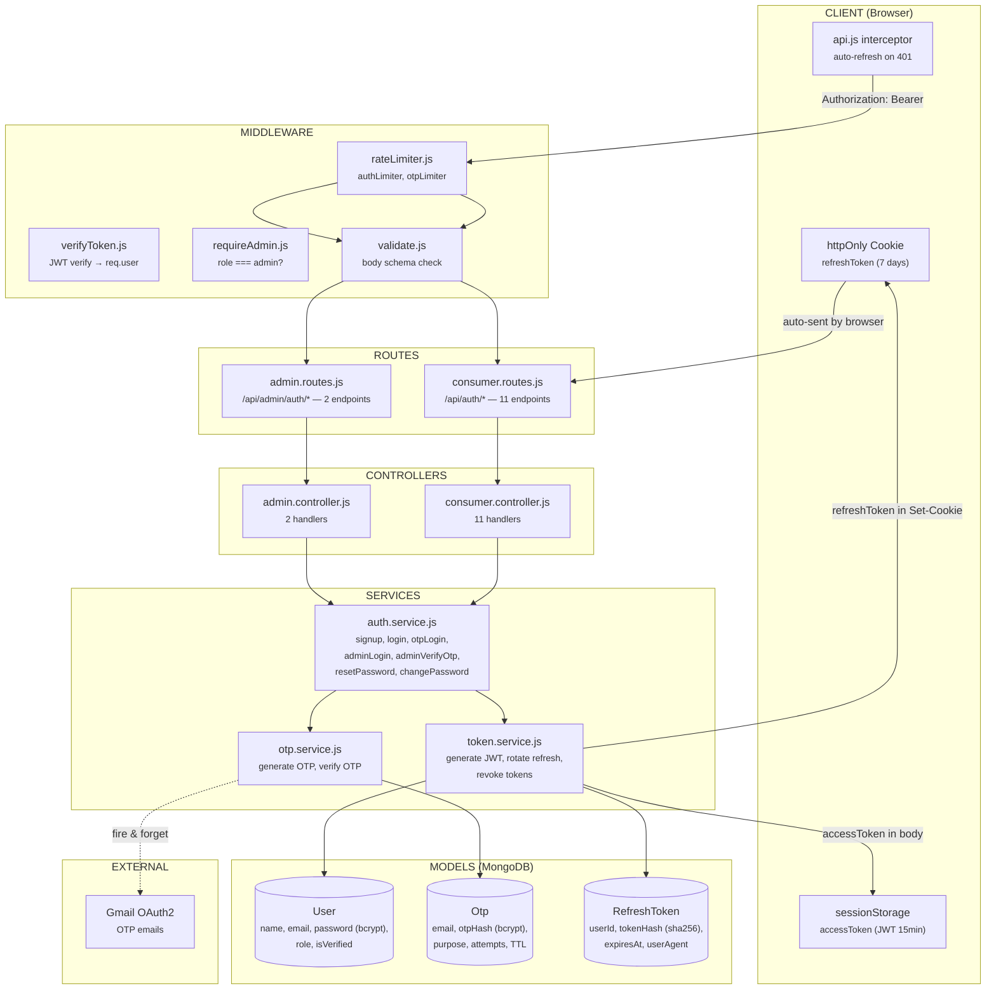

# Auth Service

Handles user registration, authentication, OTP verification, admin 2FA, token lifecycle, and password management.

---

## Architecture Overview



---

## What's Stored Where (and Why)

```
┌──────────────────────────────────────────────────────────────────────┐
│                         BROWSER                                      │
│                                                                      │
│  ┌─────────────────────────────┐  ┌────────────────────────────────┐│
│  │     sessionStorage          │  │     httpOnly Cookie            ││
│  │                             │  │                                ││
│  │  oops-access-token:         │  │  refreshToken:                 ││
│  │  "eyJhbGci..."             │  │  "3f8a9c7b2e1d..."            ││
│  │                             │  │                                ││
│  │  • JWT with payload:        │  │  • Random 64-byte hex          ││
│  │    { userId, role, type }   │  │  • NO data inside — just a key ││
│  │  • Signed with server secret│  │  • Can't be read by JavaScript ││
│  │  • Expires in 15 min        │  │  • Browser sends automatically ││
│  │  • Readable by JS (but      │  │  • httpOnly: JS can't touch it ││
│  │    tamper = signature fail)  │  │  • secure: HTTPS only (prod)  ││
│  │  • Dies when tab closes     │  │  • sameSite: strict            ││
│  │                             │  │  • path: /api/auth (only sent  ││
│  │  WHY sessionStorage?        │  │    to auth endpoints)          ││
│  │  → Needs to be in JS to     │  │  • Survives tab close          ││
│  │    set Authorization header  │  │  • Expires in 7 days           ││
│  │  → Tab-scoped = safe        │  │                                ││
│  └─────────────────────────────┘  │  WHY httpOnly cookie?           ││
│                                    │  → XSS can't steal it          ││
│                                    │  → No JS access = no theft     ││
│                                    └────────────────────────────────┘│
└──────────────────────────────────────────────────────────────────────┘

┌──────────────────────────────────────────────────────────────────────┐
│                         MONGODB                                      │
│                                                                      │
│  ┌─────────────────────┐  ┌──────────────────┐  ┌─────────────────┐│
│  │  users collection   │  │  otps collection  │  │ refreshtokens   ││
│  │                     │  │                   │  │  collection     ││
│  │  password: bcrypt   │  │  otpHash: bcrypt  │  │                 ││
│  │  hash (12 rounds)   │  │  hash (10 rounds) │  │  tokenHash:     ││
│  │                     │  │                   │  │  sha256 hash    ││
│  │  Never stored plain │  │  Never stored     │  │                 ││
│  │                     │  │  plain             │  │  Never stored   ││
│  │                     │  │                   │  │  plain           ││
│  │                     │  │  TTL index on     │  │                 ││
│  │                     │  │  expiresAt →      │  │  TTL index on   ││
│  │                     │  │  auto-deletes     │  │  expiresAt →    ││
│  │                     │  │  after 5 min      │  │  auto-deletes   ││
│  │                     │  │                   │  │  after 7 days   ││
│  └─────────────────────┘  └──────────────────┘  └─────────────────┘│
│                                                                      │
│  NOTHING is stored in plain text.                                    │
│  Passwords → bcrypt. OTPs → bcrypt. Refresh tokens → sha256.        │
│  Even if the DB is breached, credentials are useless.                │
└──────────────────────────────────────────────────────────────────────┘

┌──────────────────────────────────────────────────────────────────────┐
│                     NEVER STORED ANYWHERE                            │
│                                                                      │
│  • Plain-text password    → hashed before hitting DB                 │
│  • Plain-text OTP         → hashed before hitting DB                 │
│  • Plain-text refresh token → hashed before hitting DB               │
│  • JWT secret keys        → only in .env, never in DB or client     │
└──────────────────────────────────────────────────────────────────────┘
```

---

## Three Types of Tokens

### 1. Access Token (JWT)

```
What:     JSON Web Token — self-contained, signed
Payload:  { userId: "abc", role: "customer", type: "access", iat: ..., exp: ... }
Signed:   HMAC-SHA256 with JWT_ACCESS_SECRET (server-side only)
Lifetime: 15 minutes
Stored:   sessionStorage (browser, per-tab)
Sent as:  Authorization: Bearer eyJhbG...
Verified: jwt.verify() — pure cryptography, no DB hit

Why JWT?  → Every API call just checks the signature. No DB lookup needed.
           Fast. Stateless. Scales.

Tamper?   → Signature breaks → 401 "Invalid token"
Steal?    → sessionStorage is tab-scoped. Tab closes = gone.
           Even if stolen via XSS, it expires in 15 min.
```

### 2. Refresh Token

```
What:     Random 64 bytes → crypto.randomBytes(64).toString('hex')
           NOT a JWT. No payload. No data. Just a random key.
Lifetime: 7 days
Stored:   httpOnly cookie (browser manages it, JS can't touch it)
           DB stores sha256(token) — never the token itself
Sent as:  Cookie header (automatic, only to /api/auth/* paths)
Verified: sha256(cookie_value) looked up in RefreshToken collection

Why random, not JWT?
  → Refresh tokens need to be revocable (logout, theft detection)
  → JWTs can't be revoked without a blacklist (defeats the purpose)
  → Random token + DB lookup = fully revocable

Why httpOnly cookie?
  → XSS attack steals localStorage/sessionStorage
  → XSS CANNOT read httpOnly cookies
  → This is the most secure place to store long-lived tokens
```

### 3. Temp Token (JWT)

```
What:     Short-lived JWT issued after OTP verification
Payload:  { email: "...", purpose: "signup", type: "temp" }
Lifetime: 10 minutes
Stored:   Client memory (React state) — not persisted
Sent as:  Request body field: { tempToken: "eyJ..." }
Purpose:  Proves "this email was verified via OTP"
           Bridges the gap between verify-otp and signup/reset-password

Why needed?
  → Without it, anyone could call POST /signup without verifying email
  → The tempToken proves step 2 (OTP verify) happened
  → It's single-use: consumed by signup/reset, then worthless
```

---

## Complete Data Flow — Every Request

### Unauthenticated Request (login, signup, public endpoints)

```
  Browser                                Server
    │                                      │
    │  POST /api/auth/login                │
    │  Headers:                            │
    │    Content-Type: application/json     │
    │  Body:                               │
    │    { email, password }               │
    │─────────────────────────────────────►│
    │                                      │
    │                              ┌───────┤  1. Rate limiter checks IP
    │                              │       │     (10 req / 15 min)
    │                              │       │
    │                              │       │  2. Validate body schema
    │                              │       │     (email required, password required)
    │                              │       │
    │                              │       │  3. controller.login()
    │                              │       │     → authService.login(email, password)
    │                              │       │
    │                              │       │  4. User.findOne({ email })
    │                              │       │     → found? continue : 401
    │                              │       │
    │                              │       │  5. user.comparePassword(password)
    │                              │       │     → bcrypt.compare(plain, hash)
    │                              │       │     → match? continue : 401
    │                              │       │
    │                              │       │  6. Generate access token:
    │                              │       │     jwt.sign({ userId, role, type: 'access' },
    │                              │       │              JWT_ACCESS_SECRET, { expiresIn: '15m' })
    │                              │       │
    │                              │       │  7. Generate refresh token:
    │                              │       │     crypto.randomBytes(64).toString('hex')
    │                              │       │
    │                              │       │  8. Store in DB:
    │                              │       │     RefreshToken.create({
    │                              │       │       userId,
    │                              │       │       tokenHash: sha256(refreshToken),
    │                              │       │       expiresAt: now + 7 days
    │                              │       │     })
    │                              │       │
    │                              │       │  9. Set cookie:
    │                              │       │     res.cookie('refreshToken', rawToken, {
    │                              │       │       httpOnly: true,
    │                              │       │       secure: true (prod),
    │                              │       │       sameSite: 'strict',
    │                              │       │       maxAge: 7 days,
    │                              │       │       path: '/api/auth'
    │                              │       │     })
    │                              └───────┤
    │                                      │
    │  ◄───────────────────────────────────│
    │  Response:                           │
    │    Status: 200                       │
    │    Set-Cookie: refreshToken=3f8a...  │
    │    Body: {                           │
    │      success: true,                  │
    │      data: {                         │
    │        user: { name, email, role },  │
    │        accessToken: "eyJhbG..."      │
    │      }                               │
    │    }                                 │
    │                                      │
    │  Browser:                            │
    │    api.js stores accessToken         │
    │    in sessionStorage                 │
    │    Cookie stored by browser          │
    │    automatically                     │
```

### Authenticated Request (any protected endpoint)

```
  Browser                                 Server
    │                                       │
    │  GET /api/orders                      │
    │  Headers:                             │
    │    Authorization: Bearer eyJhbG...    │  ← from sessionStorage
    │    Cookie: refreshToken=3f8a...       │  ← auto-sent by browser (but ignored
    │                                       │     for non-/api/auth paths)
    │──────────────────────────────────────►│
    │                                       │
    │                               ┌───────┤  1. verifyToken middleware:
    │                               │       │     Extract "Bearer eyJ..." from header
    │                               │       │     jwt.verify(token, JWT_ACCESS_SECRET)
    │                               │       │
    │                               │       │     Decoded: { userId, role, type: 'access' }
    │                               │       │
    │                               │       │     NO DB HIT. Pure cryptography.
    │                               │       │     If signature valid → set req.user
    │                               │       │     If expired → 401 "Token expired"
    │                               │       │     If tampered → 401 "Invalid token"
    │                               │       │
    │                               │       │  2. req.user = { userId: "abc", role: "customer" }
    │                               │       │
    │                               │       │  3. Controller uses req.user.userId
    │                               │       │     to query orders for that user
    │                               └───────┤
    │                                       │
    │  ◄────────────────────────────────────│
    │  Response: { orders: [...] }          │
```

### Token Refresh (when access token expires)

```
  Browser                                 Server
    │                                       │
    │  GET /api/orders                      │
    │  Authorization: Bearer eyJ...(expired)│
    │──────────────────────────────────────►│
    │                                       │
    │  ◄──── 401 "Token expired" ──────────│
    │                                       │
    │  api.js interceptor catches 401       │
    │  Automatic retry:                     │
    │                                       │
    │  POST /api/auth/refresh               │
    │  Cookie: refreshToken=3f8a...         │  ← browser sends automatically
    │  (no body, no auth header)            │
    │──────────────────────────────────────►│
    │                                       │
    │                               ┌───────┤  1. Extract refreshToken from cookie
    │                               │       │
    │                               │       │  2. Compute sha256(refreshToken)
    │                               │       │
    │                               │       │  3. Find & DELETE from DB:
    │                               │       │     RefreshToken.findOneAndDelete({
    │                               │       │       tokenHash: sha256(token)
    │                               │       │     })
    │                               │       │
    │                               │       │     Found → continue (token consumed)
    │                               │       │     Not found → THEFT DETECTED (see below)
    │                               │       │
    │                               │       │  4. Check expiry → expired? 401
    │                               │       │
    │                               │       │  5. Generate NEW accessToken
    │                               │       │  6. Generate NEW refreshToken
    │                               │       │  7. Store NEW sha256(refreshToken) in DB
    │                               │       │  8. Set NEW cookie
    │                               └───────┤
    │                                       │
    │  ◄────────────────────────────────────│
    │  Set-Cookie: refreshToken=NEW_TOKEN   │
    │  Body: { accessToken: "NEW_JWT" }     │
    │                                       │
    │  api.js:                              │
    │    Store new accessToken in           │
    │    sessionStorage                     │
    │    Retry the original GET /orders     │
    │    with the new token                 │
    │                                       │
    │  GET /api/orders                      │
    │  Authorization: Bearer NEW_JWT        │
    │──────────────────────────────────────►│
    │                                       │
    │  ◄──── { orders: [...] } ────────────│
    │                                       │
    │  User never noticed anything.         │
    │  Completely transparent.              │
```

---

## Theft Detection (Refresh Token Rotation)

This is the key security feature. Here's what happens if an attacker steals a refresh token:

```
  Timeline:
  ─────────────────────────────────────────────────────────────

  T1: User logs in
      → Refresh token A created → sha256(A) stored in DB

  T2: Attacker somehow steals token A (e.g. network intercept)
      → Now both user and attacker have token A

  T3: User calls /refresh with token A (normal usage)
      → Server: delete sha256(A), create token B
      → User now has token B
      → Token A is DEAD (deleted from DB)

  T4: Attacker tries /refresh with stolen token A
      → Server: sha256(A) not found in DB
      → THEFT DETECTED
      → Server knows: "This token was already used.
         Someone has a copy. Compromise detected."
      → 401 "Token reuse detected"

      ┌─────────────────────────────────────────┐
      │  If we wanted to be aggressive:          │
      │  Delete ALL RefreshTokens for that user  │
      │  → Force re-login on ALL devices         │
      │  → Attacker AND user both kicked out     │
      │  → User re-authenticates (safe)          │
      │  → Attacker can't (no credentials)       │
      └─────────────────────────────────────────┘

  Why this works:
  → Each refresh token is single-use
  → Using it consumes it (deleted from DB)
  → If it appears twice, one of them is stolen
  → The DB acts as the source of truth
```

---

## Security Model — Why Each Decision

```
  ATTACK                          DEFENSE
  ──────────────────────────────  ────────────────────────────────────

  XSS steals tokens              httpOnly cookie → JS can't read it
  from JS                        Access token in sessionStorage is
                                  short-lived (15 min) and tab-scoped

  CSRF forges requests           sameSite=strict → cookie not sent
                                  cross-origin. Also, API checks
                                  Authorization header (not cookie)
                                  for auth, so CSRF is useless

  Modify JWT to change           JWT is signed with server secret.
  role from customer to admin    Any modification → signature fails
                                  → 401 "Invalid token"

  Modify cookie to               Cookie has no role data — just random
  change role                    bytes. Nothing to modify.

  Brute-force login              authLimiter: 10 attempts / 15 min per IP
                                  After 10 fails → 429 "Too many attempts"

  Brute-force OTP                otpVerifyLimiter: 5 attempts / 5 min
                                  OTP model: max 5 attempts per OTP
                                  After 5 fails → OTP deleted, must request new

  OTP flood (spam emails)        otpLimiter: 3 OTPs / 10 min per email

  Enumerate emails               Login returns same "Invalid credentials"
  ("does this email exist?")     for wrong email AND wrong password

  Stolen refresh token           Token rotation → single use → theft
                                  detected on reuse

  Stolen access token            15 min expiry. Limited damage window.
                                  Can't be used to get new tokens
                                  (refresh requires the cookie, not JWT)

  Password in DB breach          bcrypt 12 rounds → takes years to crack
                                  per password

  OTP in DB breach               bcrypt 10 rounds + 5 min TTL → useless
                                  by the time you crack it

  Replay attack on               Refresh token rotation → each token
  refresh endpoint               works exactly once
```

---

## Folder Structure

```
auth/
  index.js                          # Barrel: exports { consumer, admin } routers
  models/
    User.js                         # name, email, password (bcrypt 12), role, isVerified
    Otp.js                          # email, otpHash (bcrypt 10), purpose, attempts, TTL
    RefreshToken.js                 # userId, tokenHash (sha256), expiresAt, userAgent
  controllers/
    consumer.controller.js          # 11 request handlers
    admin.controller.js             # 2 request handlers (2FA flow)
  services/
    token.service.js                # JWT generation, refresh token rotation, revocation
    otp.service.js                  # OTP generation, verification, email dispatch
    auth.service.js                 # High-level flows that orchestrate token + otp services
  routes/
    consumer.routes.js              # /api/auth/*
    admin.routes.js                 # /api/admin/auth/*
  validations/
    auth.validation.js              # Schemas for all request bodies
```

**Service dependency graph:**
```
  auth.service.js
    ├── calls → token.service.js  (JWT + refresh token ops)
    └── calls → otp.service.js    (OTP generation + verification)

  token.service.js
    ├── reads/writes → User model
    └── reads/writes → RefreshToken model

  otp.service.js
    ├── reads/writes → Otp model
    └── calls → notification.service.js  (send OTP email, fire & forget)
```

---

## All Flows

### Consumer Signup (3-step OTP)

```
  Client                         Server                          Gmail
    │                              │                               │
    │  POST /send-otp              │                               │
    │  { email, purpose: signup }  │                               │
    │─────────────────────────────►│  check email not registered   │
    │                              │  generate 6-digit OTP         │
    │                              │  bcrypt hash → store in Otp   │
    │                              │───────────────────────────────►│  send email
    │  ◄── { expiresIn: 300 }     │                               │
    │                              │                               │
    │  POST /verify-otp            │                               │
    │  { email, otp, purpose }     │                               │
    │─────────────────────────────►│  find Otp doc (email+purpose) │
    │                              │  check attempts < 5           │
    │                              │  bcrypt.compare(otp, hash)    │
    │                              │  delete Otp doc (consumed)    │
    │  ◄── { tempToken }          │  sign temp JWT (10 min)       │
    │                              │                               │
    │  POST /signup                │                               │
    │  { name, email, password,    │                               │
    │    tempToken }               │                               │
    │─────────────────────────────►│  jwt.verify(tempToken)        │
    │                              │  check email matches          │
    │                              │  check purpose === signup     │
    │                              │  User.create(isVerified=true) │
    │                              │  generate access + refresh    │
    │  ◄── { user, accessToken }   │                               │
    │  + Set-Cookie: refreshToken  │                               │
```

### Consumer Login (Password)

```
  POST /login { email, password }
    │
    ├── User not found?          → 401 "Invalid credentials"
    ├── Not verified?            → 403 "Please verify your email first"
    ├── Password mismatch?       → 401 "Invalid credentials" (same msg, no enumeration)
    │
    └── Success:
        ├── Update lastLoginAt
        ├── Generate accessToken (JWT 15min)
        ├── Generate refreshToken (random 64 bytes)
        ├── Store sha256(refreshToken) in RefreshToken collection
        ├── Set httpOnly cookie
        └── Return { user, accessToken }
```

### Consumer Login (OTP — passwordless)

```
  1. POST /send-otp   { email, purpose: "login" }  → check user exists + verified
  2. POST /verify-otp  { email, otp, purpose: "login" }
       └── On success: issue tokens directly (no temp token needed)
```

### Admin Login (Mandatory 2FA)

```
  Admin                          Server                          Gmail
    │                              │                               │
    │  POST /admin/auth/login      │                               │
    │  { email, password }         │                               │
    │─────────────────────────────►│  find User where role=admin   │
    │                              │  verify password              │
    │                              │  generate 2FA OTP             │
    │                              │───────────────────────────────►│
    │  ◄── { requiresOtp: true }  │                               │
    │                              │  (NO tokens issued yet)       │
    │                              │                               │
    │  POST /admin/auth/verify-otp │                               │
    │  { email, otp }              │                               │
    │─────────────────────────────►│  verify OTP (purpose: admin-2fa) │
    │                              │  NOW issue tokens             │
    │  ◄── { user, accessToken }   │                               │
    │  + Set-Cookie: refreshToken  │                               │
    │                              │                               │
    │  Admin can ONLY get tokens   │                               │
    │  after password + OTP.       │                               │
    │  No shortcut.                │                               │
```

### Forgot Password (OTP-verified reset)

```
  1. POST /send-otp        { email, purpose: "reset-password" }
  2. POST /verify-otp      { email, otp, purpose: "reset-password" }
       → Returns { tempToken }
  3. POST /reset-password   { email, newPassword, tempToken }
       → Verify tempToken (proves OTP was completed)
       → Update password (pre-save hook re-hashes)
       → Delete ALL refresh tokens for user (force re-login everywhere)
```

### Change Password (logged-in)

```
  POST /change-password  { currentPassword, newPassword }
    │
    ├── Verify current password with bcrypt
    ├── Set new password (pre-save hook hashes it)
    ├── Delete ALL refresh tokens for user
    ├── Clear cookie
    └── Return "Password changed, please login again"

    → All sessions invalidated. Must re-login with new password.
```

### Logout

```
  POST /logout
    ├── Read refreshToken from cookie
    ├── Delete that one RefreshToken doc from DB
    ├── Clear cookie (maxAge=0)
    └── Return "Logged out"

  POST /logout-all  (requires JWT)
    ├── Delete ALL RefreshToken docs for req.user.userId
    ├── Clear cookie
    └── Return "Logged out from all devices"
```

---

## Session Lifecycle (Full Picture)

```
  ┌─── LOGIN ──────────────────────────────────────────────────────┐
  │                                                                 │
  │  Browser receives:                                              │
  │    Body:       { accessToken: "eyJ..." }  → sessionStorage     │
  │    Set-Cookie: refreshToken=3f8a...       → browser cookie jar │
  │                                                                 │
  └─────────────────────────┬──────────────────────────────────────┘
                            │
                            ▼
  ┌─── USING THE APP ──────────────────────────────────────────────┐
  │                                                                 │
  │  Every API call:                                                │
  │    api.js reads accessToken from sessionStorage                │
  │    Adds header: Authorization: Bearer eyJ...                   │
  │    Server: jwt.verify() → fast, no DB hit                      │
  │                                                                 │
  │  This works for 15 minutes.                                     │
  │                                                                 │
  └─────────────────────────┬──────────────────────────────────────┘
                            │
                            ▼  (15 min later)
  ┌─── ACCESS TOKEN EXPIRES ───────────────────────────────────────┐
  │                                                                 │
  │  API returns 401 "Token expired"                                │
  │  api.js interceptor catches it automatically                   │
  │  Calls POST /api/auth/refresh (cookie sent by browser)         │
  │  Gets new accessToken → stores in sessionStorage               │
  │  Retries the original request                                   │
  │                                                                 │
  │  User notices nothing. Completely transparent.                  │
  │                                                                 │
  └─────────────────────────┬──────────────────────────────────────┘
                            │
                            ▼  (this repeats every 15 min for 7 days)
  ┌─── TAB CLOSED ────────────────────────────────────────────────┐
  │                                                                 │
  │  sessionStorage wiped (tab-scoped)                             │
  │  accessToken gone                                               │
  │  Cookie persists (not session-scoped)                          │
  │                                                                 │
  │  Next tab open:                                                 │
  │    No accessToken → api.js calls /refresh                      │
  │    Cookie present → new accessToken issued                     │
  │    User is still logged in                                      │
  │                                                                 │
  └─────────────────────────┬──────────────────────────────────────┘
                            │
                            ▼  (7 days later)
  ┌─── REFRESH TOKEN EXPIRES ──────────────────────────────────────┐
  │                                                                 │
  │  /refresh returns 401                                           │
  │  api.js redirects to /auth/login                               │
  │  User must log in again                                         │
  │                                                                 │
  └────────────────────────────────────────────────────────────────┘


  ┌─── LOGOUT ────────────────────────────────────────────────────┐
  │                                                                 │
  │  Cookie cleared + RefreshToken deleted from DB                 │
  │  sessionStorage cleared                                         │
  │  No tokens exist anywhere → must log in again                  │
  │                                                                 │
  └────────────────────────────────────────────────────────────────┘
```

---

## Endpoints

| Method | Path | Auth | Rate Limit | Description |
|--------|------|------|------------|-------------|
| POST | `/api/auth/send-otp` | - | otpLimiter (3/10min) | Send 6-digit OTP |
| POST | `/api/auth/verify-otp` | - | otpVerifyLimiter (5/5min) | Verify OTP |
| POST | `/api/auth/signup` | - | authLimiter (10/15min) | Complete signup with tempToken |
| POST | `/api/auth/login` | - | authLimiter | Password login |
| POST | `/api/auth/refresh` | Cookie | - | Rotate refresh token |
| POST | `/api/auth/logout` | Cookie | - | Clear current session |
| POST | `/api/auth/logout-all` | JWT | - | Revoke all sessions |
| POST | `/api/auth/reset-password` | - | authLimiter | Set new password with tempToken |
| GET | `/api/auth/me` | JWT | - | Get current user profile |
| PATCH | `/api/auth/profile` | JWT | - | Update profile fields |
| POST | `/api/auth/change-password` | JWT | authLimiter | Change password (revokes all sessions) |
| POST | `/api/admin/auth/login` | - | authLimiter | Admin step 1 (password → sends OTP) |
| POST | `/api/admin/auth/verify-otp` | - | otpVerifyLimiter | Admin step 2 (OTP → issues tokens) |

---

## Edge Cases

| Scenario | What Happens |
|----------|-------------|
| OTP expired (5 min) | 400 "OTP expired, request a new one" |
| Wrong OTP | Increment attempts. 400 "Invalid OTP, N attempts left" |
| Max OTP attempts (5) | OTP deleted. 429 "Too many failed attempts, request a new OTP" |
| OTP spam (>3 in 10min) | Rate limiter: 429 "Too many OTP requests" |
| Signup with existing email | 409 "Email already registered" |
| Login with unverified email | 403 "Please verify your email first" |
| Wrong password | 401 "Invalid credentials" (same msg as wrong email — no enumeration) |
| Tampered JWT | Signature fails: 401 "Invalid token" |
| Expired JWT | 401 "Token expired" → client auto-refreshes |
| Reused refresh token | THEFT DETECTED: 401 "Token reuse detected" |
| Expired refresh token | 401 → client redirects to login |
| Customer accessing admin route | 403 "Admin access required" |
| Missing auth header | 401 "Authentication required" |
| Password change | All refresh tokens revoked → re-login on all devices |
| Password reset | All refresh tokens revoked → re-login on all devices |
