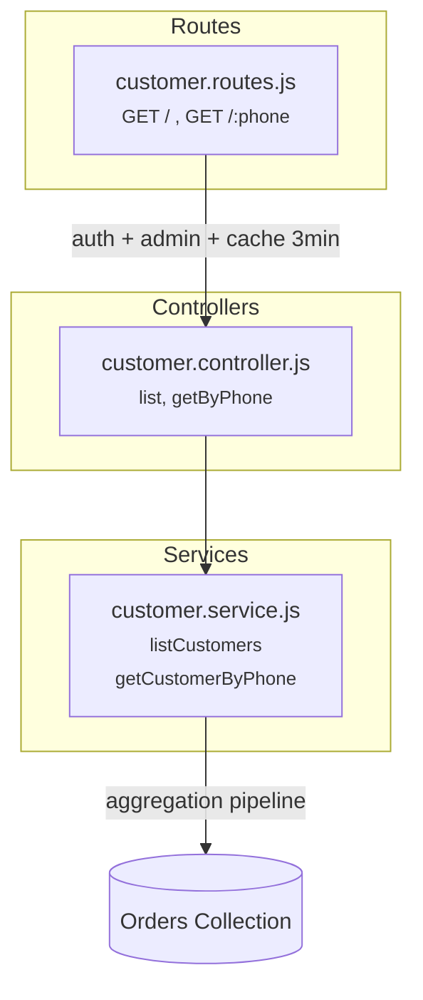

# Customer Service

Admin-only. Derives customer profiles from the Orders collection — no separate Customer model.

## Architecture



## Folder Structure

```
customer/
  index.js                          # Barrel: exports router
  controllers/
    customer.controller.js          # list, getByPhone
  services/
    customer.service.js             # Aggregation pipelines on Orders
  routes/
    customer.routes.js              # Admin-only, cached at 3 min
```

No `models/` — customers are derived, not stored.

## Aggregation Pipeline

### List customers

```js
Order.aggregate([
  // Optional: $match for search by name or phone
  { $group: {
      _id:           "$shipping.phone",      // group by phone number
      name:          { $last: "$shipping.fullName" },
      phone:         { $first: "$shipping.phone" },
      totalSpent:    { $sum: "$total" },
      orderCount:    { $sum: 1 },
      lastOrderDate: { $max: "$createdAt" },
  }},
  { $sort: { lastOrderDate: -1 } },
  { $skip: offset },
  { $limit: pageSize }
])
```

### Get customer by phone

Same pipeline plus:
```js
  addresses: { $addToSet: "$shipping" }    // collect all unique shipping addresses
```

Plus a separate query for full order history:
```js
  Order.find({ "shipping.phone": phone }).sort({ createdAt: -1 })
```

## Output Shape

```js
{
  customer: {
    name: "Rahul Sharma",
    phone: "9876543210",
    totalSpent: 4596,
    orderCount: 2,
    lastOrderDate: "2026-04-28T...",
    addresses: [{ fullName, address1, city, pincode, ... }]
  },
  orders: [{ orderId, items, total, status, createdAt, paymentMethod }]
}
```

## Endpoints

| Method | Path | Auth | Cache | Description |
|--------|------|------|-------|-------------|
| GET | `/api/admin/customers` | Admin | 3 min | Paginated list. Query: `?search=&sort=&page=&limit=` |
| GET | `/api/admin/customers/:phone` | Admin | - | Customer detail + order history |
