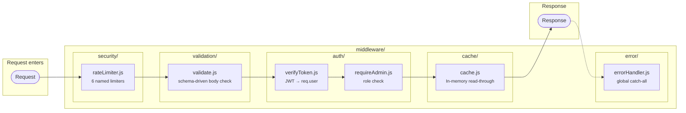

# Shared Middleware

Reusable Express middleware used across all services. Imported via barrel (`require('../../middleware')`).

## Architecture



## Folder Structure

```
middleware/
  index.js                          # Barrel export — one-line import for all middleware
  auth/
    verifyToken.js                  # verifyAccessToken, optionalAuth
    requireAdmin.js                 # requireAdmin
  cache/
    cache.js                        # cacheMiddleware(prefix, ttlSeconds)
  security/
    rateLimiter.js                  # authLimiter, otpLimiter, otpVerifyLimiter, apiLimiter, adminLimiter, uploadLimiter
  validation/
    validate.js                     # validate(schema) → middleware
  error/
    errorHandler.js                 # Global error handler (last in chain)
```

## Import Pattern

All services import from the barrel:

```js
const { verifyAccessToken, requireAdmin, adminLimiter, validate, cacheMiddleware } = require('../../middleware');
```

---

## auth/verifyToken.js

### `verifyAccessToken`

Extracts `Bearer <token>` from Authorization header, verifies JWT, sets `req.user`.

```
  Authorization: Bearer eyJ...
    │
    ├── Missing header?       → 401 "Authentication required"
    ├── jwt.verify() fails?   → passed to error handler (401)
    ├── decoded.type ≠ access → 401 "Invalid token"
    │
    └── Success:
        req.user = { userId: "...", role: "customer|admin" }
        next()
```

### `optionalAuth`

Same as above but never rejects. If token is missing or invalid, continues without `req.user`.

Used for endpoints that work with or without auth (e.g. product listing that might personalize).

---

## auth/requireAdmin.js

### `requireAdmin`

Must be used AFTER `verifyAccessToken`. Checks `req.user.role === 'admin'`.

```
  req.user exists?
    │
    ├── No, or role ≠ admin  → 403 "Admin access required"
    └── Yes + admin          → next()
```

---

## cache/cache.js

### `cacheMiddleware(prefix, ttlSeconds)`

In-memory read-through cache. Builds cache key from prefix + sorted query params hash.

```
  Request: GET /api/products?category=Tops&page=1
    │
    ├── Build key: "products:list:a1b2c3d4" (md5 of sorted query)
    │     │
    │     ├── Key exists in cache?
    │     │     └── YES (HIT) → return cached JSON, skip controller
    │     │
    │     └── NO (MISS) → call next()
    │                       intercept res.json()
    │                       on success (status < 400):
    │                         write response to cache with TTL
    │                       send response to client
```

**Cache TTLs used across services:**

| Service | Prefix | TTL |
|---------|--------|-----|
| Product (public) | `products:list`, `products:detail` | 5 min |
| Dashboard | `dashboard:stats`, `dashboard:revenue`, etc. | 2 min |
| Customer | `customers:list` | 3 min |
| Settings | `settings:connections`, `settings:triggers` | 10 min |

---

## security/rateLimiter.js

Six pre-configured rate limiters using in-memory storage.

| Export | Window | Max Requests | Key | Used By |
|--------|--------|-------------|-----|---------|
| `authLimiter` | 15 min | 10 | IP | login, signup, reset password, change password |
| `otpLimiter` | 10 min | 3 | email | send-otp |
| `otpVerifyLimiter` | 5 min | 5 | email | verify-otp |
| `apiLimiter` | 1 min | 100 | IP | all `/api` routes (global) |
| `adminLimiter` | 1 min | 50 | IP | all admin routes |
| `uploadLimiter` | 1 min | 10 | IP | file uploads |

---

## validation/validate.js

### `validate(schema)`

Schema-driven request body validation. Returns a middleware function.

```js
const schema = {
  email:    { required: true, type: 'string', match: /^[^\s@]+@[^\s@]+\.[^\s@]+$/, matchMessage: 'Invalid email' },
  password: { required: true, type: 'string', minLength: 6 },
  role:     { type: 'string', enum: ['customer', 'admin'] },
  age:      { type: 'number', min: 0 },
  items:    { required: true, type: 'array', custom: (val) => val.length === 0 ? 'empty' : null },
};

router.post('/example', validate(schema), controller.handler);
```

**Supported rules:**

| Rule | Description |
|------|-------------|
| `required` | Field must be present and non-empty |
| `type` | `'string'`, `'number'`, `'array'`, `'object'` |
| `minLength` / `maxLength` | String length bounds |
| `min` | Numeric minimum |
| `enum` | Value must be in the given array |
| `match` + `matchMessage` | Regex test |
| `custom(value, body)` | Return error string or null |

On failure: throws `ApiError(400, 'Validation failed', [{ field, message }])`.

---

## error/errorHandler.js

Global catch-all. Last middleware in the chain. Normalizes all errors into consistent JSON.

```
  Any error thrown in route handlers
    │
    ▼
  errorHandler(err, req, res, next)
    │
    ├── ApiError (custom)              → err.statusCode + err.message
    │
    ├── Mongoose ValidationError       → 400 + field-level error details
    │     { errors: [{ field: "name", message: "name is required" }] }
    │
    ├── Mongoose CastError             → 400 "Invalid ID format"
    │
    ├── Mongoose 11000 (duplicate)     → 409 "<field> already exists"
    │
    ├── JWT TokenExpiredError          → 401 "Token expired"
    │
    ├── JWT JsonWebTokenError          → 401 "Invalid token"
    │
    ├── Multer LIMIT_FILE_SIZE         → 400 "File exceeds size limit"
    │
    ├── Multer LIMIT_UNEXPECTED_FILE   → 400 "Too many files"
    │
    └── Unknown / programming error    → 500 "Internal server error"
          (full stack trace logged via logger.error)
          (generic message sent to client — no internals leaked)
```

**Response shape (always consistent):**
```json
{
  "success": false,
  "statusCode": 400,
  "message": "Validation failed",
  "errors": [
    { "field": "email", "message": "email is required" },
    { "field": "password", "message": "password must be at least 6 characters" }
  ]
}
```
