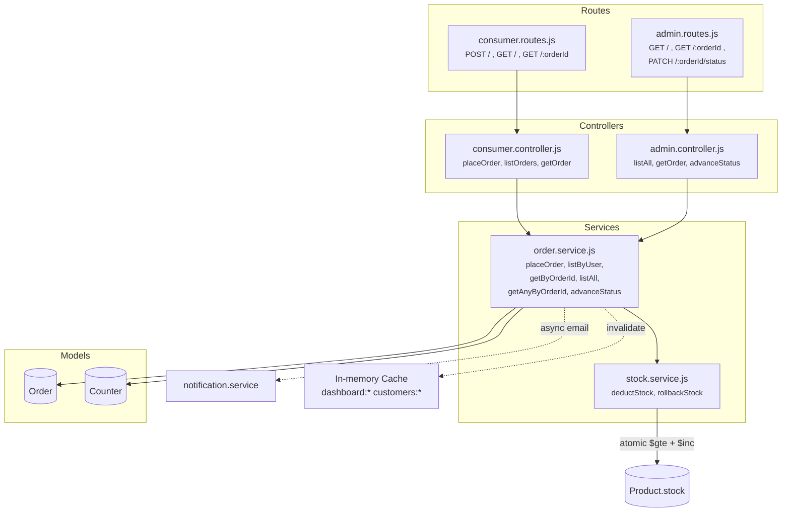

# Order Service

Place orders with atomic stock deduction, list/track orders, and advance status (forward-only).

## Architecture



## Folder Structure

```
order/
  index.js                          # Barrel: exports { consumer, admin } routers
  models/
    Order.js                        # orderId, items[], shipping, status, statusHistory[]
    Counter.js                      # Atomic counter for order ID generation (OOPS-XXXXXX)
  controllers/
    consumer.controller.js          # placeOrder, listOrders, getOrder (ownership check)
    admin.controller.js             # listAll, getOrder (no ownership), advanceStatus
  services/
    order.service.js                # Business logic: place, list, status transitions
    stock.service.js                # Atomic stock deduction with rollback
  routes/
    consumer.routes.js              # /api/orders/* (JWT required)
    admin.routes.js                 # /api/admin/orders/* (admin required)
  validations/
    order.validation.js             # placeOrder, advanceStatus schemas
```

## Place Order Flow

```
  Client                          order.service                 stock.service              MongoDB
    │                                 │                              │                        │
    │  POST /orders                   │                              │                        │
    │  { items, shipping, payment }   │                              │                        │
    │────────────────────────────────►│                              │                        │
    │                                 │                              │                        │
    │                                 │  1. VALIDATE each item       │                        │
    │                                 │     - product exists?         │                        │
    │                                 │     - status === available?   │                        │
    │                                 │     - size in product.sizes?  │                        │
    │                                 │                              │                        │
    │                                 │  2. RE-FETCH prices from DB  │                        │
    │                                 │     (ignore client prices)    │                        │
    │                                 │                              │                        │
    │                                 │  3. COMPUTE TOTALS           │                        │
    │                                 │     subtotal = Σ(price × qty)│                        │
    │                                 │     codFee = cod ? 49 : 0    │                        │
    │                                 │     total = subtotal + codFee│                        │
    │                                 │                              │                        │
    │                                 │  4. DEDUCT STOCK ───────────►│                        │
    │                                 │                              │  For each item:        │
    │                                 │                              │  findOneAndUpdate({    │
    │                                 │                              │    _id: productId,     │
    │                                 │                              │    status: 'available',│
    │                                 │                              │    stock.M: { $gte: 2 }│
    │                                 │                              │  }, {                  │
    │                                 │                              │    $inc: {stock.M: -2} │
    │                                 │                              │  })                    │
    │                                 │                              │       │                │
    │                                 │                              │   success? ─► next item│
    │                                 │                              │   fail?    ─► ROLLBACK │
    │                                 │                              │       all deducted     │
    │                                 │  ◄──────────────────────────│                        │
    │                                 │                              │                        │
    │                                 │  5. Counter.getNextOrderId() │                        │
    │                                 │     (atomic $inc → OOPS-XXXXXX)                      │
    │                                 │                              │                        │
    │                                 │  6. Order.create()           │                        │
    │                                 │                              │                        │
    │                                 │  7. Send email (fire & forget)                       │
    │                                 │                              │                        │
    │  ◄─────── { order } ───────────│                              │                        │
```

## Forward-Only Status Transitions

```
  placed ──► processing ──► shipped ──► out-for-delivery ──► delivered
   [0]         [1]           [2]            [3]                [4]

  Rules enforced in advanceStatus():
    ✗ newIndex <= currentIndex     → 400 "Cannot revert order status"
    ✗ newIndex !== currentIndex+1  → 400 "Must advance one step at a time"
    ✗ newIndex === currentIndex    → 400 "Order is already <status>"
    ✓ newIndex === currentIndex+1  → Update + push to statusHistory
```

Each transition records:
```js
statusHistory.push({
  status:    "shipped",
  changedAt: new Date(),
  changedBy: adminUserId
})
```

## Order ID Generation

Uses a `Counter` collection with atomic `findOneAndUpdate` + `$inc`:
```
Counter { name: "orderId", value: 7 }
  → $inc: { value: 1 } → value = 8
  → "OOPS-" + (8).toString(36).toUpperCase().padStart(6, '0')
  → "OOPS-000008"
```

## Endpoints

| Method | Path | Auth | Description |
|--------|------|------|-------------|
| POST | `/api/orders` | JWT | Place order (server computes total + deducts stock) |
| GET | `/api/orders` | JWT | List user's orders |
| GET | `/api/orders/:orderId` | JWT | Single order (ownership check) |
| GET | `/api/admin/orders` | Admin | All orders. Query: `?status=&search=&page=&limit=&sort=` |
| GET | `/api/admin/orders/:orderId` | Admin | Any order detail |
| PATCH | `/api/admin/orders/:orderId/status` | Admin | Advance status one step |

## Edge Cases

| Scenario | Response |
|----------|----------|
| Insufficient stock (concurrent buy) | Atomic `$gte` rejects + rollback all deducted items |
| Product deleted/unavailable | 400 "Product [name] is no longer available" |
| Product sold-out | 400 "[name] is sold out" |
| Client sends wrong price | Ignored — server re-fetches from DB |
| COD fee tampering | Server computes: cod → +49, prepaid → +0 |
| Backward status change | 400 "Cannot revert order status" |
| Skip a status step | 400 "Must advance one step at a time" |
| User views another's order | 403 "Access denied" |
| Empty items array | 400 validation error |
| Qty ≤ 0 | 400 validation error |
| Invalid size for product | 400 "Size [X] not available for [product]" |
