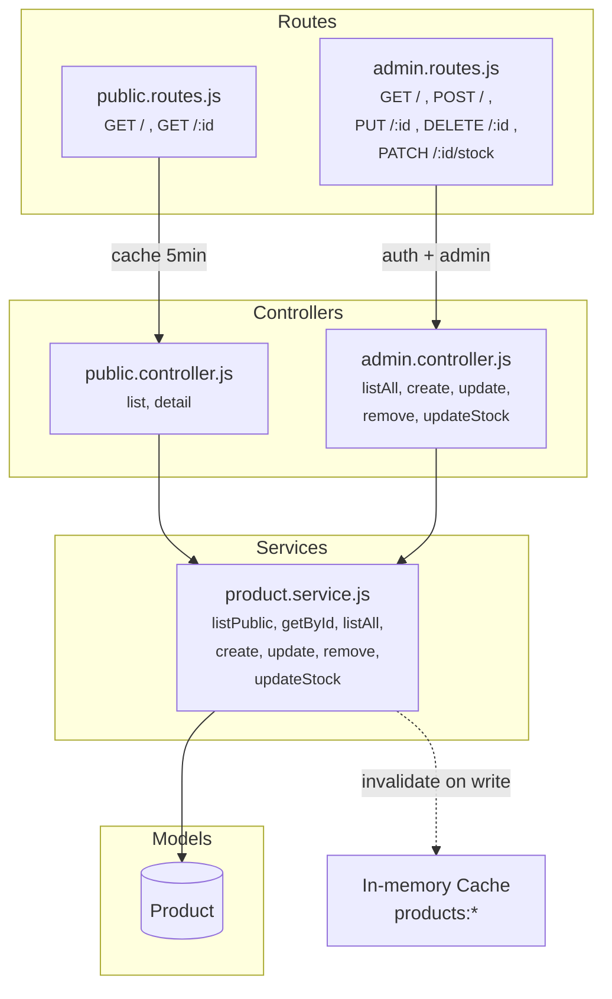

# Product Service

CRUD operations and stock management for products. Public endpoints are cached. Admin writes invalidate cache.

## Architecture



## Folder Structure

```
product/
  index.js                          # Barrel: exports { public, admin } routers
  models/
    Product.js                      # name, price, category, status, sizes, stock (Map), images
  controllers/
    public.controller.js            # list (paginated + filtered), detail (with related)
    admin.controller.js             # listAll, create, update, remove, updateStock
  services/
    product.service.js              # All CRUD + stock operations + cache invalidation
  routes/
    public.routes.js                # GET /api/products, GET /api/products/:id
    admin.routes.js                 # /api/admin/products/* (auth + admin + rate limit)
  validations/
    product.validation.js           # create, update, updateStock schemas
```

## Product Model

```js
{
  name:        "Classic White Tee",
  shortDesc:   "Essential cotton crew neck",
  description: "A timeless classic...",
  price:       799,
  category:    "Tops",
  status:      "available",               // available | sold-out | coming-soon
  sizes:       ["S", "M", "L", "XL"],
  image:       "https://res.cloudinary.com/...",
  images:      ["url1", "url2"],
  stock:       { "S": 25, "M": 30, "L": 20, "XL": 15 },   // Map<size, quantity>
  fabric:      { composition: "100% Cotton", care: "Machine wash cold" },
  shipping:    "Free shipping on prepaid orders...",
  related:     [ObjectId, ObjectId],       // refs to other Products
}
```

## Caching

| Endpoint | Cache Key | TTL | Invalidated By |
|----------|-----------|-----|----------------|
| `GET /api/products` | `products:list:{queryHash}` | 5 min | Any product create/update/delete |
| `GET /api/products/:id` | `products:detail:{queryHash}` | 5 min | Any product create/update/delete |

Cache invalidation uses `SCAN + DEL` with pattern `products:*`.

## Endpoints

| Method | Path | Auth | Description |
|--------|------|------|-------------|
| GET | `/api/products` | - | List products. Query: `?category=Tops&status=available&search=tee&page=1&limit=20` |
| GET | `/api/products/:id` | - | Product detail with populated `related` |
| GET | `/api/admin/products` | Admin | List ALL products (any status) |
| POST | `/api/admin/products` | Admin | Create product |
| PUT | `/api/admin/products/:id` | Admin | Update product |
| DELETE | `/api/admin/products/:id` | Admin | Delete product |
| PATCH | `/api/admin/products/:id/stock` | Admin | Update stock: `{ stock: { "S": 10, "M": 5 } }` |

## Edge Cases

| Scenario | Response |
|----------|----------|
| Product not found | 404 "Product not found" |
| Invalid ObjectId in URL | 400 "Invalid ID format" |
| Negative stock value | 400 validation error |
| Delete product with existing orders | Safe — orders snapshot product data at time of purchase |
