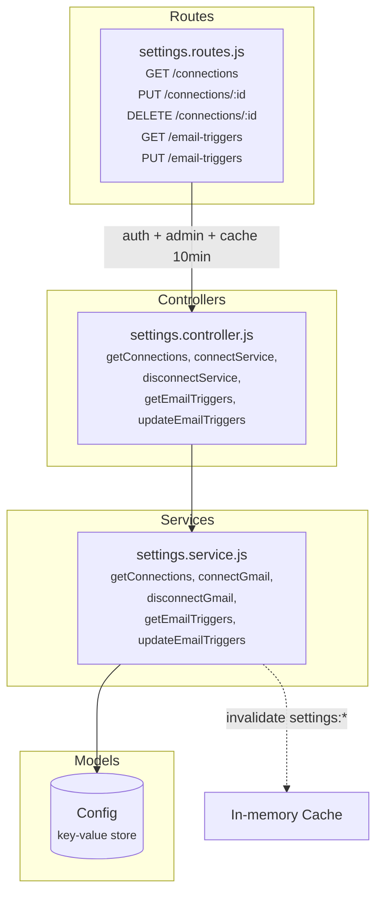

# Settings Service

Admin-only. Key-value config store for Gmail connection and email trigger toggles.

## Architecture



## Folder Structure

```
settings/
  index.js                          # Barrel: exports router
  models/
    Config.js                       # { key: String (unique), value: Mixed }
  controllers/
    settings.controller.js          # 5 request handlers
  services/
    settings.service.js             # Gmail connect/disconnect + trigger CRUD
  routes/
    settings.routes.js              # Admin-only, cached at 10 min
```

## Config Documents

Two documents in the `configs` collection:

### Gmail Connection
```js
{
  key:   "gmail-connection",
  value: {
    email:       "store@oopsfashion.com",
    refreshToken: "1//0...",                // Google OAuth2 refresh token
    connectedAt: "2026-04-01T..."
  }
  // or value: null when disconnected
}
```

### Email Triggers
```js
{
  key:   "email-triggers",
  value: {
    "placed":           true,     // send email when order is placed
    "processing":       false,    // don't send for processing
    "shipped":          true,     // send when shipped
    "out-for-delivery": false,
    "delivered":        true      // send when delivered
  }
}
```

## How Other Services Use Settings

```
  order.service (placeOrder / advanceStatus)
    │
    ├── Config.findOne({ key: "email-triggers" })  → should we send?
    ├── Config.findOne({ key: "gmail-connection" }) → transporter creds
    │
    └── if trigger enabled AND gmail connected:
          notification.service.sendOrderEmail(order, status, gmailConnection)
```

## Endpoints

| Method | Path | Auth | Cache | Description |
|--------|------|------|-------|-------------|
| GET | `/api/admin/settings/connections` | Admin | 10 min | Get Gmail connection status |
| PUT | `/api/admin/settings/connections/:id` | Admin | - | Connect (id=`gmail`). Body: `{ email, refreshToken? }` |
| DELETE | `/api/admin/settings/connections/:id` | Admin | - | Disconnect |
| GET | `/api/admin/settings/email-triggers` | Admin | 10 min | Get trigger map |
| PUT | `/api/admin/settings/email-triggers` | Admin | - | Replace trigger map |
