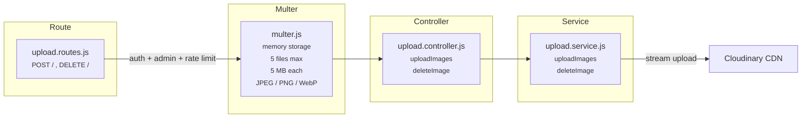

# Upload Service

Admin-only. Uploads images to Cloudinary via multer memory storage. Supports batch upload (up to 5 files).

## Architecture



## Folder Structure

```
upload/
  index.js                          # Barrel: exports router
  controllers/
    upload.controller.js            # uploadImages, deleteImage
  services/
    upload.service.js               # Cloudinary upload (stream) + delete
  routes/
    upload.routes.js                # POST / (multipart), DELETE / (json)
  middlewares/
    multer.js                       # Memory storage, file filter, size limit
```

## Upload Flow

```
  Admin Client              Multer                upload.service          Cloudinary
    │                         │                        │                     │
    │  POST /api/upload       │                        │                     │
    │  Content-Type:          │                        │                     │
    │  multipart/form-data    │                        │                     │
    │  field: "images"        │                        │                     │
    │  (1-5 files)            │                        │                     │
    │────────────────────────►│                        │                     │
    │                         │  For each file:        │                     │
    │                         │  ✓ mimetype in         │                     │
    │                         │    [jpeg,png,webp]?    │                     │
    │                         │  ✓ size < 5MB?         │                     │
    │                         │  Store in memory       │                     │
    │                         │───────────────────────►│                     │
    │                         │                        │  Promise.allSettled │
    │                         │                        │  for each file:     │
    │                         │                        │  upload_stream() ──►│
    │                         │                        │  ◄── { url,        │
    │                         │                        │        publicId }  │
    │                         │                        │                     │
    │  ◄──── {                │                        │                     │
    │    uploaded: [           │                        │                     │
    │      { url, publicId }, │                        │                     │
    │      { url, publicId }  │                        │                     │
    │    ],                   │                        │                     │
    │    errors: [...]        │  partial success OK    │                     │
    │  }                      │                        │                     │
```

## Delete Flow

```
  DELETE /api/upload
  Body: { "publicId": "oops/abc123" }
    │
    └── cloudinary.uploader.destroy(publicId)
```

## Endpoints

| Method | Path | Auth | Rate Limit | Description |
|--------|------|------|------------|-------------|
| POST | `/api/upload` | Admin | 10/min | Upload images. Multipart, field `images`, max 5 files |
| DELETE | `/api/upload` | Admin | 10/min | Delete image. Body: `{ publicId }` |

## Constraints

| Rule | Value |
|------|-------|
| Max files per request | 5 |
| Max file size | 5 MB |
| Allowed types | `image/jpeg`, `image/png`, `image/webp` |
| Cloudinary folder | configurable via `CLOUDINARY_FOLDER` env |

## Partial Success

Uses `Promise.allSettled` — if 3 of 5 uploads succeed, returns:
```json
{
  "uploaded": [
    { "url": "https://res.cloudinary.com/...", "publicId": "oops/abc" },
    { "url": "https://res.cloudinary.com/...", "publicId": "oops/def" },
    { "url": "https://res.cloudinary.com/...", "publicId": "oops/ghi" }
  ],
  "errors": [
    { "file": "broken.jpg", "error": "Upload failed" },
    { "file": "toobig.png", "error": "File too large" }
  ]
}
```
